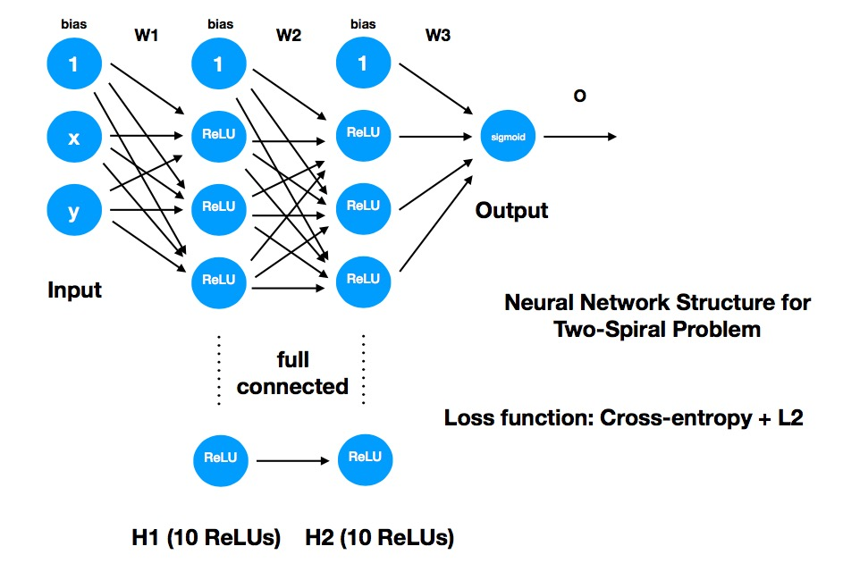
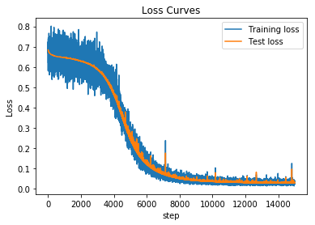
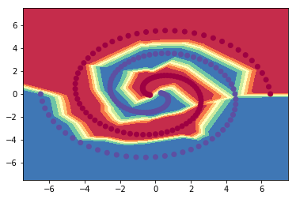

```python
# Solution for two-spiral problem created by CaTheother
import numpy as np;
import pandas as pd;
import matplotlib.pyplot as plt;

trainLoss = [];
testLoss = [];

# parameters
MAX = 15000; # Max epoch
M = 30; # batch size M
MU = 0.03; # Learning Rate
LAMBDA = 0.001; # Regularization Rate

# f'(x) = 0 (x<0) 1(x>=0)
def ReLU(A):
    return A*(A>=0);

# f'(x) = f(x)(1-f(x))
def sigmoid(A):
    return 1/(1+np.exp(-A));

# EPSILON: to address log(0) = NaN
EPSILON = 10e-8;

# Cross-Entropy
def loss(Y, O):
    loss = sum(-Y*np.log(O+EPSILON)-(1-Y)*np.log(1-O+EPSILON))/(len(Y));
    return loss;

# Regularizer L2
def l2(A,B,C):
    return sum(sum(A**2))+sum(sum(B**2))+sum(sum(C**2));

# visualization, input: Anonymous functions
def plot_decision_boundary(pred_func):
    # Set min and max values and give it some padding
    x_min, x_max = -7 - .5, 7 + .5
    y_min, y_max = -7 - .5, 7 + .5
    h = 0.01
    # Generate a grid of points with distance h between them
    xx, yy = np.meshgrid(np.arange(x_min, x_max, h), 
                         np.arange(y_min, y_max, h))
    # Predict the function value for the whole gid
    Z = pred_func(np.c_[xx.ravel(), yy.ravel()])
    Z = Z.reshape(xx.shape)
    # Plot the contour and training examples
    plt.contourf(xx, yy, Z, cmap=plt.cm.Spectral)
    plt.scatter(X_test[:, 0], X_test[:, 1], c=Y_test, 
                cmap=plt.cm.Spectral);
```


```python
# load datasets
Data_Set = pd.read_csv("TSdataset.csv");

# in this case, we treat all datasets as test sets
Test_Set = Data_Set.sample(frac=1);
X_test = np.array(Test_Set[['x','y']]);
Y_test = np.array(Test_Set[['cls']]);
```


```python
def predict(W, X):
    X = np.hstack((np.ones([len(X),1]),X));
    W1 = W[0];
    W2 = W[1];
    W3 = W[2];
    M = len(X);
    # hidden layer 1
    A1 = X.dot(W1.transpose());
    H1 = ReLU(A1);
    # hidden layer 2
    H1 = np.hstack((np.ones([M,1]),H1));
    A2 = H1.dot(W2.transpose());
    H2 = ReLU(A2);
    # output layer
    H2 = np.hstack((np.ones([M,1]),H2));
    A3 = H2.dot(W3.transpose());
    O = sigmoid(A3);
    return O;
```


```python
# initialize weights randomly
W1 = np.random.rand(10,3) - 0.5;
W2 = np.random.rand(10,11) - 0.5;
W3 = np.random.rand(1,11) - 0.5;
```


```python
# Train : mini-batch
for i in range(0,MAX):
    # sample datasets
    batch_Set = Data_Set.sample(M);
    X = np.array(batch_Set[['x','y']]);
    Y = np.array(batch_Set[['cls']]);
    X = np.hstack((np.ones([M,1]),X));
    
    # Step1: Forward Propagation
    # hidden layer 1
    A1 = X.dot(W1.transpose());
    H1 = ReLU(A1);
    # hidden layer 2
    H1 = np.hstack((np.ones([M,1]),H1));
    A2 = H1.dot(W2.transpose());
    H2 = ReLU(A2);
    # output layer
    H2 = np.hstack((np.ones([M,1]),H2));
    A3 = H2.dot(W3.transpose());
    O = sigmoid(A3);
    
    # Step2: Backward Propagation
    # Compute delta
    # Sigmoid: f'(x) = f(x)(1-f(x))
    delta3 = (O - Y) / M; # cross-entropy with sigmoid
    # ReLU: f'(x) = 0 (x<0), 1(x>=0)
    delta2 = delta3.dot(W3)[:,1:11] * (A2>=0);
    delta1 = delta2.dot(W2)[:,1:11] * (A1>=0); 
    # Compute gradients for each weights
    Gradient3 = delta3.transpose().dot(H2) + 2 * LAMBDA * W3;
    Gradient2 = delta2.transpose().dot(H1) + 2 * LAMBDA * W2;
    Gradient1 = delta1.transpose().dot(X) + 2 * LAMBDA * W1;
    # Update weights
    W3 = W3 - MU * Gradient3;
    W2 = W2 - MU * Gradient2;
    W1 = W1 - MU * Gradient1;
    
    W = np.array([W1,W2,W3]);
    O_test = predict(W, X_test);
    
    trainLoss.append(loss(Y,O)+ 0 * l2(W1,W2,W3));
    testLoss.append(loss(Y_test,O_test));
```


```python
# visualization 1
%matplotlib inline
line_train, = plt.plot(range(0,MAX), trainLoss[0:MAX]);
line_test, = plt.plot(range(0,MAX), testLoss[0:MAX]);
plt.title("Loss Curves");
plt.xlabel("step");
plt.ylabel("Loss");
plt.legend([line_train,line_test],['Training loss','Test loss']);

# compute precision
precision = sum(Y_test==1*(O_test>=0.5))/len(Y_test);
print('Precision over all datasets:',100*precision[0],'%');
```

    Precision over all datasets: 100.0 %





```python
# visualization 2
plot_decision_boundary(lambda X: predict(W,X));
```





```python

```
